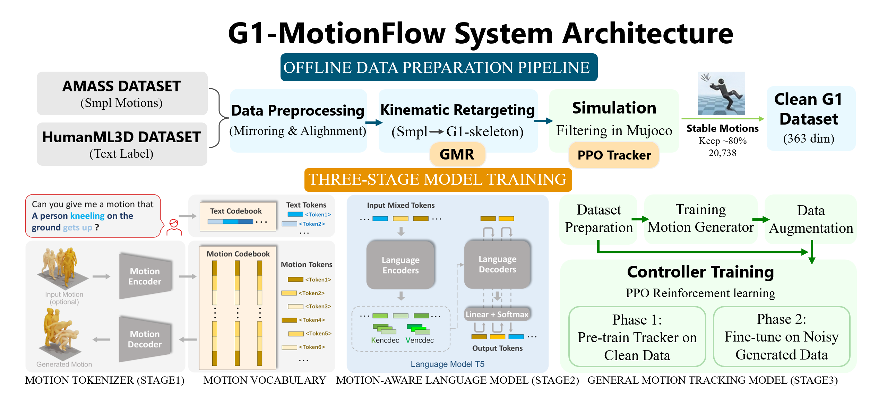
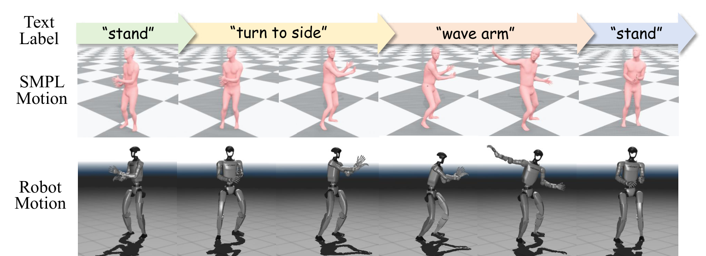
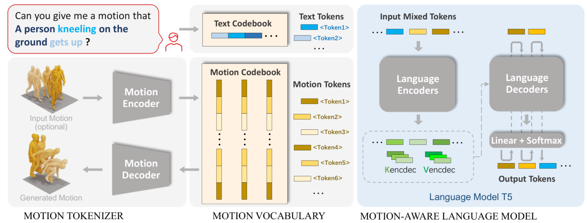
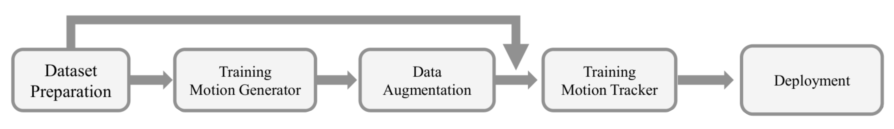
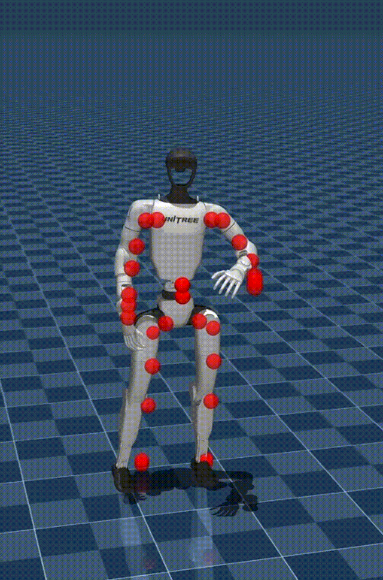
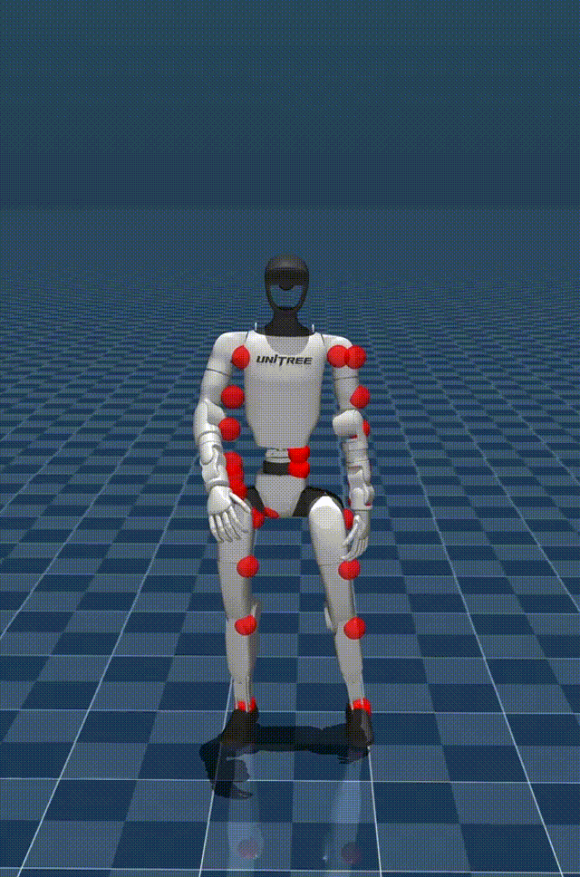

> 🌐 [English](README.md) | **简体中文**

---

<div align="center">
    <h1> G1-Motionflow: 自然语言驱动的人形机器人动作生成框架 </h1>
</div>

<div align="center">
    <h2> 弥合高层人类意图与底层物理执行的鸿沟 </h2>
</div>

<div align="center">
    <p align="center">
      <a href="#-项目简介">项目简介</a> •
      <a href="#-快速开始">快速开始</a> •
      <a href="#-技术架构">技术架构</a> •
      <a href="#-核心突破">核心突破</a> •
      <a href="#-成果展示">成果展示</a> •
      <a href="#-未来工作">未来工作</a> •
      <a href="#-开源协议">开源协议</a>
    </p>
</div>

https://github.com/user-attachments/assets/982983d2-fc45-4eb5-b54d-033501930c35

## 🏃 项目简介

当前主流的通用控制器主要依赖预设轨迹或持续的遥操作，缺乏运行时的灵活性与机器人的自主性。高层动作生成模型推理产生的参考轨迹与底层高质量动作捕捉训练数据之间存在分布差异，直接部署会导致机器人在真实物理世界中失稳甚至摔倒。

**G1-Motionflow** 探索基于自然语言的实时交互式动作生成与控制，填补了“高层人类意图表达”与“底层机器人物理执行”之间的空白。使机器人能够摆脱固定指令束缚，实现单任务中的自由意图表达和多任务平滑过渡。

<div align="center">
    
</div>

## ⚡ 快速开始

<details>
  <summary><b>环境配置与下载</b></summary>

### 1. 环境配置

首先配置 Python 虚拟环境，并安装必要的依赖以及大文件下载工具：

```bash
conda create python=3.10 --name g1-flow
conda activate g1-flow
pip install -r requirements.txt

# 安装 gdown 用于绕过 Google Drive 大文件下载限制
pip install gdown 
````

### 2. 下载预训练模型

运行以下脚本以从 HuggingFace 下载所需的预训练语言模型与语音模型。模型将被自动放置于 `deps/` 目录下：

```bash
bash prepare_t5.sh
bash prepare_whisper.sh
```

### 3. 下载项目资源

运行以下脚本从 Google Drive 获取预训练的运动生成权重、追踪器配置及原始数据。`.tar.xz` 压缩包将被自动下载、解压至主目录并清理：

```bash
# 获取实验配置与预训练权重 (生成 experiments/ 文件夹)
bash download_experiments.sh  

# 获取底层追踪器模型与配置 (生成 tracker/ 文件夹)
bash download_tracker.sh      

# [可选] 获取重定向至 G1 的原始动作序列 (仅下载 raw_data.tar.xz)
bash download_raw_data.sh     
```

</details>

## ⚙️ 技术架构

针对从自然语言到物理机器人部署的完整链路，本框架分为两大核心模块：物理导向的数据集构建与三阶段端到端模型训练。

### 1. 物理导向的数据集构建

<details>
<summary><b>构建过程</b></summary>

当前大规模文本-动作数据集多基于 SMPL 骨骼，缺乏真实物理世界约束，不适合机器人直接模仿。

  * **跨构型重定向 (SMPL to Robot):** 以 AMASS 数据集为基础。通过运动学解算将 SMPL 关节旋转角度转化为空间位置，利用 GMR 工具重定向至 Unitree G1 的 29 个关节，并结合 HumanML3D 的文本标注构建数据集。
    <div align="center">
    
    </div>
  * **镜像增强与运动学解算:** 开发自动检测与对齐脚本统一全局位姿。对关节空间位置镜像后，通过逆运动学解算、物理柔性插值及下采样，生成包含各关节位置、角度及脚部接触信息的 363 维数据。
  * **物理仿真筛选:** 将全量 24,788 条生成序列送入预训练追踪模型在 MuJoCo 中进行测试。最终淘汰约 20% 导致机器人摔倒的劣质数据。

</details>

### 2. 三阶段端到端训练框架

<details>
<summary><b>训练过程</b></summary>
<div align="center">

</div>

  * **第一阶段：动作特征离散化 (VQ-VAE)。** 将筛选后的 363 维连续动作序列送入 VQ-VAE 进行特征提取与重建，压缩映射为包含 512 个离散 Token 的码本 (Codebook)。
  * **第二阶段：语义到动作生成 (T5-Base)。** 将自然语言文本与动作 Token 拼接组合输入 T5-base，通过自回归方式学习从语义到离散动作指令的映射规律。
  * **第三阶段：底层控制与物理部署 (RL Tracking)。** 参考 `rl_sar` 开源框架，在物理仿真环境中利用 PPO 算法训练全身运动追踪策略。设定关节位置跟踪误差、速度惩罚、扭矩限制等复合奖励函数，实现向真实硬件的鲁棒部署。在训练阶段大量引入生成器产生的轨迹，提前适应噪声，闭环增强系统鲁棒性。
    <div align="center">
    
    </div>

</details>

## 🔬 核心突破：解决“零漂移”问题

在 VQ-VAE 训练初期（仅保留关节旋转角度时），动作还原存在“零漂移”现象：随时间推移产生累积误差导致姿态扭曲。

<div align="center">


</div>

<details>
<summary><b>解决方案</b></summary>

  * **解决方案:** 借鉴多传感器融合思路，采用**“主动过冗余” (Active Over-Redundancy)** 策略。
  * **实现路径:** 在特征向量中同时引入关节旋转角度与关节空间位置信息，使两者在损失函数中相互制约。
  * **损失函数:** $Loss = L_{recon} + L_{vel} + L_{commit}$（组合重建损失、速度损失和承诺损失）。有效修正了运动学链条上的累积偏差，彻底消除零漂移。

</details>

## 📊 成果展示

https://github.com/user-attachments/assets/2f44abc3-ef92-49f7-a94a-68f3126e831b

目前已初步打通了“指令-生成-驱动”的完整闭环：

1.  **极低时延与高效率:** 框架已实现轻量化，支持在笔记本端一键运行。从自然语言输入到生成 Token 并驱动 G1 机器人，端到端耗时**不足 1 秒**。
2.  **强大的语义理解:** T5-base 模型实现了对高度抽象指令的理解（如“走在很滑的路面上、如履薄冰”、“像拉满的弓蓄势待发”）。生成的动作序列打破了传统预设动作库的局限，兼顾了多样性与物理稳定性。

## 🚀 局限性与未来工作

当前模型存在长程动作生成受限和指令自由度不足的局限。

下一阶段计划引入基于部件级分解的运动合成架构（FrankenMotion 范式）：

  * **空间维度 (部件级表征):** 将机器人解耦为左臂、右臂、躯干、双腿等独立部分。利用大语言模型将“走路”重写为详细的部件描述（如“双腿交替前行，双臂随之摆动”），通过部件的独立生成与空间耦合实现多任务并行控制。
  * **时间维度 (长程任务分解):** 引入大语言模型作为“高级规划师”，将长程任务指令拆解为短程的部件级动作基元。通过“搭积木”的方式突破数据集帧数限制，构建长序列。

## 📖 致谢

本项目合并了以下上游项目的代码与资源：

  * [MotionGPT](https://github.com/OpenMotionLab/MotionGPT.git) (Copyright (c) 2023 OpenMotionLab)
  * [TextOp](https://github.com/TeleHuman/TextOp.git) (Copyright (c) 2025 TextOp Team)

## ⚖️ 开源协议

本项目遵循 [MIT License](https://www.google.com/search?q=LICENSE) 开源协议。

```

```